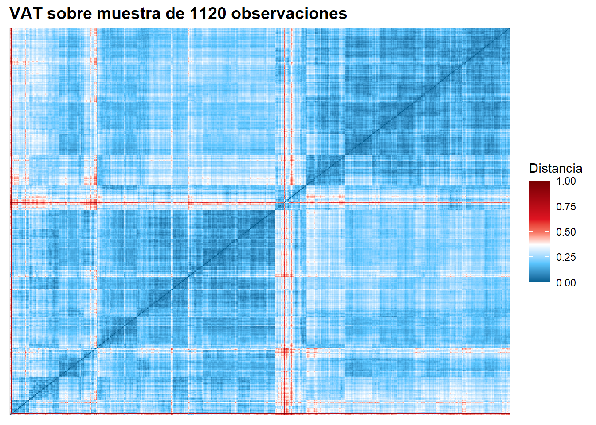
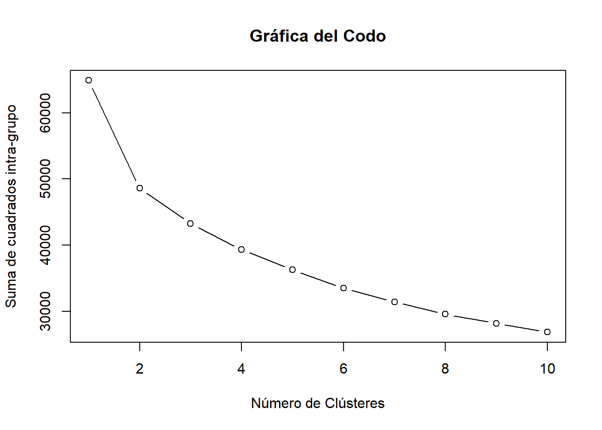
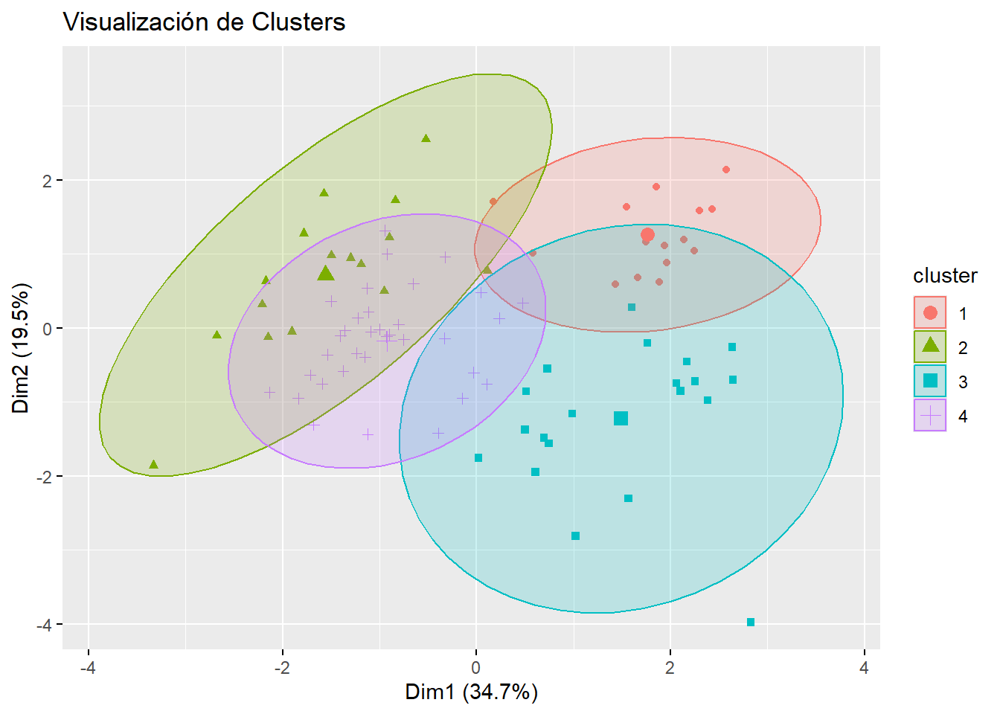

#' ---
#' title: "Clustering Analysis"
#' author: "Rodrigo Mansilla"
#' date: "2025-02-12"
#' output: html_document
#' ---

#' ## Cargar librerías necesarias


#' ## Estructura del dataset

``` r
str(movies_clean_transformed)
```

```
## 'data.frame':	9269 obs. of  16 variables:
##  $ popularity_log           : num  -0.245 -1.257 1.25 0.437 0.105 ...
##  $ budget_log               : num  0.8 0.999 1.115 0.959 0.612 ...
##  $ revenue_log              : num  0.74 0.861 1.213 1.213 0.937 ...
##  $ runtime                  : num  -0.0854 0.3446 1.4912 0.7746 0.6671 ...
##  $ genresAmount             : num  -0.514 0.351 0.351 -1.378 -0.514 ...
##  $ productionCoAmount       : num  -0.4642 -0.0758 -0.4642 -0.4642 -0.4642 ...
##  $ productionCountriesAmount: num  -0.2483 0.0763 -0.2483 -0.2483 -0.2483 ...
##  $ voteCount_log            : num  1.07 -0.33 1.65 1.65 1.52 ...
##  $ voteAvg                  : num  -0.798 0.0167 2.0535 1.5443 1.5443 ...
##  $ actorsPopularity         : num  2.074 0.393 -0.536 -0.151 -1.267 ...
##  $ actorsAmount             : num  -0.0593 -0.0595 -0.0579 -0.0589 -0.056 ...
##  $ releaseYear              : num  -0.962 -1.108 -1.035 -0.671 -4.891 ...
##  $ originalLanguage         : chr  "en" "en" "en" "en" ...
##  $ video                    : logi  FALSE FALSE FALSE FALSE FALSE FALSE ...
##  $ productionCompanyCountry : chr  "US|US" "US|US|JP" "US|" "|US" ...
##  $ productionCountry        : chr  "United States of America" "Japan|United States of America" "United States of America" "United States of America" ...
```

``` r
summary(movies_clean_transformed)
```

```
##  popularity_log      budget_log       revenue_log         runtime       
##  Min.   :-1.2569   Min.   :-1.0292   Min.   :-1.0323   Min.   :-3.5967  
##  1st Qu.:-0.7715   1st Qu.:-1.0292   1st Qu.:-1.0323   1st Qu.:-0.3720  
##  Median :-0.2315   Median : 0.5494   Median : 0.3848   Median :-0.0137  
##  Mean   : 0.0000   Mean   : 0.0000   Mean   : 0.0000   Mean   : 0.0000  
##  3rd Qu.: 0.5381   3rd Qu.: 0.9932   3rd Qu.: 1.0078   3rd Qu.: 0.4521  
##  Max.   : 2.5841   Max.   : 1.1672   Max.   : 1.2133   Max.   :23.2757  
##   genresAmount     productionCoAmount productionCountriesAmount
##  Min.   :-2.2429   Min.   :-1.24116   Min.   :-0.5728          
##  1st Qu.:-0.5139   1st Qu.:-0.85269   1st Qu.:-0.2483          
##  Median : 0.3506   Median :-0.07577   Median :-0.2483          
##  Mean   : 0.0000   Mean   : 0.00000   Mean   : 0.0000          
##  3rd Qu.: 0.3506   3rd Qu.: 0.31269   3rd Qu.: 0.0763          
##  Max.   :11.5893   Max.   :33.33188   Max.   :49.7367          
##  voteCount_log         voteAvg         actorsPopularity   actorsAmount     
##  Min.   :-2.02609   Min.   :-5.27884   Min.   :-6.6778   Min.   :-0.05991  
##  1st Qu.:-0.70129   1st Qu.:-0.59431   1st Qu.:-0.6268   1st Qu.:-0.05958  
##  Median : 0.06089   Median : 0.01671   Median :-0.1306   Median :-0.05937  
##  Mean   : 0.00000   Mean   : 0.00000   Mean   : 0.0000   Mean   : 0.00000  
##  3rd Qu.: 0.75592   3rd Qu.: 0.72957   3rd Qu.: 0.4768   3rd Qu.:-0.05898  
##  Max.   : 1.65171   Max.   : 3.58102   Max.   :25.4474   Max.   :23.74248  
##   releaseYear      originalLanguage     video         productionCompanyCountry
##  Min.   :-7.7275   Length:9269        Mode :logical   Length:9269             
##  1st Qu.:-0.3078   Class :character   FALSE:9187      Class :character        
##  Median : 0.2742   Mode  :character   TRUE :82        Mode  :character        
##  Mean   : 0.0000                                                              
##  3rd Qu.: 0.7106                                                              
##  Max.   : 1.0016                                                              
##  productionCountry 
##  Length:9269       
##  Class :character  
##  Mode  :character  
##                    
##                    
## 
```

#' ## Selección de Variables Relevantes

``` r
df_numeric <- movies_clean_transformed %>% 
  select(budget_log, revenue_log, popularity_log, voteAvg, actorsPopularity, runtime, releaseYear)
```

#' ## Estadístico de Hopkins

``` r
set.seed(123)
n_sample <- min(1120, nrow(df_numeric))
df_sample_hopkins <- df_numeric %>% sample_n(n_sample)
hopkins_stat_sample <- hopkins(df_sample_hopkins)
cat("Estadístico de Hopkins (muestra):", sprintf("%.20f", hopkins_stat_sample), "\n")
```

```
## Estadístico de Hopkins (muestra): 0.99997935245046976060
```

#' ## Método del Codo para determinar número óptimo de clusters

``` r
set.seed(123)
elbow_plot <- fviz_nbclust(df_numeric, kmeans, method = "wss") +
  labs(subtitle = "Método del Codo")
print(elbow_plot)
```



#' ## Aplicación de K-means con 4 clusters

``` r
set.seed(123)
km <- kmeans(df_numeric, centers = 4, iter.max = 100, nstart = 25)
movies_clean_transformed$grupo <- km$cluster
print(km)
```

```
## K-means clustering with 4 clusters of sizes 3538, 2205, 859, 2667
## 
## Cluster means:
##   budget_log revenue_log popularity_log    voteAvg actorsPopularity    runtime
## 1  0.9933517   0.9572748      0.2463231  0.0311030       0.17758004  0.3471110
## 2 -0.6142879  -0.8354599     -0.4942528 -1.0566233      -0.11535626 -0.3502406
## 3  0.3480093   0.4527643     -0.4794361  0.7181920      -0.56302647  0.5572013
## 4 -0.9219773  -0.7249996      0.2362849  0.6010067       0.04114065 -0.3503689
##   releaseYear
## 1  0.01355738
## 2  0.34990497
## 3 -2.40444562
## 4  0.46715872
## 
## Clustering vector:
##    [1] 1 1 1 1 3 1 1 3 1 1 1 1 3 1 1 1 1 1 1 3 1 1 1 3 1 1 1 1 1 1 3 1 3 1 1 3 1
##   [38] 1 3 3 3 3 3 1 3 3 1 1 3 1 3 1 1 4 4 4 3 4 1 1 1 3 1 1 1 1 3 1 1 3 1 3 1 1
##   [75] 3 3 1 3 3 3 3 1 3 1 1 1 3 1 3 1 3 1 1 1 3 3 1 3 1 1 1 1 3 1 1 1 3 1 1 1 1
##  [112] 1 1 3 1 3 3 1 1 1 3 1 3 3 1 3 1 3 3 3 3 3 1 3 1 1 1 3 3 3 3 1 1 3 3 3 3 1
##  [149] 3 1 3 1 1 3 1 3 1 3 3 3 1 1 1 1 3 1 3 1 1 3 1 1 1 1 1 1 1 1 3 1 1 3 3 1 1
##  [186] 3 3 3 3 3 3 1 3 3 1 1 1 1 3 3 3 3 1 1 1 1 3 1 3 1 3 3 3 1 1 1 2 2 3 1 1 1
##  [223] 1 1 3 3 1 2 3 1 3 3 1 3 3 1 3 1 1 1 1 3 1 1 3 1 3 3 3 3 3 4 4 4 1 1 3 3 2
##  [260] 2 1 1 3 1 3 1 1 1 1 1 3 1 1 1 3 1 3 3 3 3 3 3 3 1 3 1 1 1 1 1 3 3 1 3 1 1
##  [297] 3 3 3 1 1 3 1 1 3 1 1 3 1 1 1 3 1 3 3 3 3 1 1 1 3 1 3 3 1 1 3 1 3 3 3 1 3
##  [334] 4 3 1 3 1 3 3 3 3 3 3 1 1 3 3 1 1 1 1 1 1 1 3 1 3 3 1 1 1 3 1 3 3 3 3 3 3
##  [371] 3 3 3 1 1 1 1 1 1 1 3 1 1 1 1 3 3 3 3 3 3 3 3 1 1 3 3 1 1 3 1 3 1 1 1 3 1
##  [408] 3 3 3 1 1 3 3 3 3 3 1 1 1 1 3 3 1 1 1 3 3 4 1 3 3 3 3 3 1 3 3 3 3 1 1 1 3
##  [445] 1 3 1 1 3 1 1 1 3 1 1 1 3 3 1 1 3 3 3 1 1 1 3 3 3 3 3 3 3 3 3 3 3 4 1 1 1
##  [482] 1 3 1 3 1 1 3 3 3 3 3 1 1 1 3 1 1 1 1 1 3 3 3 3 3 3 1 4 3 3 3 3 3 1 3 3 3
##  [519] 3 3 3 4 1 3 3 3 1 1 1 1 1 1 1 1 2 4 1 1 1 1 1 1 1 1 1 4 1 1 1 1 1 1 3 3 3
##  [556] 1 1 1 1 1 1 1 1 3 1 1 1 3 1 1 1 1 1 1 1 1 1 1 1 1 3 1 1 1 1 1 1 1 1 1 1 1
##  [593] 1 1 1 1 1 4 3 1 1 1 1 1 1 1 1 1 3 1 3 1 1 3 1 1 1 1 1 3 1 3 2 3 3 1 1 3 1
##  [630] 3 2 3 3 1 1 1 1 1 1 1 1 1 3 2 3 1 1 3 3 1 3 3 1 3 3 3 1 1 1 3 1 3 1 3 3 1
##  [667] 1 1 1 1 1 1 1 1 1 1 1 1 3 1 1 1 1 1 3 1 1 1 3 3 3 3 1 3 3 1 1 1 1 3 1 1 1
##  [704] 1 1 3 3 1 1 1 1 1 1 1 1 1 1 1 3 1 1 1 1 1 1 1 1 1 1 1 4 1 1 1 3 2 1 4 1 1
##  [741] 1 1 1 1 1 1 1 3 1 1 1 1 1 1 2 1 1 1 1 1 1 1 1 3 1 1 1 3 2 1 1 1 1 1 1 1 1
##  [778] 3 1 1 4 1 3 1 1 1 1 1 1 2 1 1 1 1 4 1 1 1 1 1 3 2 1 1 3 1 1 1 1 1 2 2 1 3
##  [815] 1 1 1 1 1 1 1 1 3 4 1 1 1 3 1 3 1 1 1 3 1 1 1 3 3 3 3 3 3 1 1 1 1 1 3 1 3
##  [852] 1 1 1 3 1 1 3 1 3 3 1 1 1 1 1 2 1 1 3 1 1 1 1 1 1 1 1 2 1 3 3 1 1 3 3 3 3
##  [889] 3 3 3 1 3 3 3 3 4 1 1 3 2 1 3 1 2 1 1 1 2 3 1 3 1 1 1 1 1 1 2 2 3 1 1 1 2
##  [926] 3 3 3 3 1 1 1 1 1 4 3 1 1 1 1 1 1 1 3 3 2 1 1 3 2 1 2 3 1 1 4 4 1 1 1 1 1
##  [963] 1 1 3 1 1 1 2 1 1 3 1 1 1 1 1 2 1 1 3 1 4 1 1 1 1 1 1 3 1 1 1 1 2 1 1 1 1
## [1000] 3 1 4 1 3 1 1 1 3 1 1 3 3 1 1 1 1 1 1 1 1 1 4 4 3 1 1 1 2 1 2 1 2 3 1 1 1
## [1037] 1 3 1 1 1 1 3 1 1 2 2 2 1 3 1 4 3 3 1 1 2 1 3 1 3 1 3 1 1 1 1 1 3 4 2 3 1
## [1074] 3 3 3 3 3 3 1 1 1 3 1 1 1 2 1 3 1 3 1 1 3 1 3 1 1 1 1 1 1 3 3 3 4 1 1 2 1
## [1111] 1 1 1 1 1 1 1 1 1 1 3 1 1 1 2 3 1 1 3 1 2 1 1 1 1 1 1 1 1 3 1 3 1 4 1 2 1
## [1148] 1 1 1 3 1 2 4 1 1 2 1 1 1 1 1 3 4 1 1 1 1 3 1 1 1 1 3 1 1 1 1 1 1 1 1 1 1
## [1185] 1 3 4 1 1 1 1 1 1 2 1 1 3 1 1 1 1 2 1 1 3 1 1 1 3 1 1 1 1 1 1 1 1 3 1 1 1
## [1222] 3 3 1 1 1 1 1 1 1 1 1 2 1 1 1 3 3 1 2 1 1 1 1 3 1 1 1 3 1 1 1 1 2 1 3 1 3
## [1259] 3 1 1 1 3 4 1 1 1 2 1 1 3 1 1 1 1 3 3 4 1 2 1 1 1 1 3 1 1 1 1 3 2 1 1 3 3
## [1296] 1 3 1 3 3 1 3 1 1 1 1 1 1 1 1 1 1 1 1 1 1 2 1 1 1 1 2 3 1 4 2 1 1 1 1 4 1
## [1333] 1 1 1 4 1 1 3 1 1 1 1 1 3 2 1 1 3 1 1 1 1 1 1 1 1 1 3 1 1 1 3 1 1 3 1 1 1
## [1370] 1 3 3 1 1 1 1 1 1 1 3 1 1 2 1 1 2 1 1 1 1 1 1 1 1 3 1 2 3 1 1 2 3 1 1 1 1
## [1407] 1 1 1 3 1 1 1 1 3 3 1 1 1 1 3 1 3 1 1 3 1 3 1 1 1 1 3 1 1 3 1 1 3 1 1 3 1
## [1444] 1 1 1 3 3 1 1 1 3 1 1 1 1 3 1 1 1 1 3 1 1 1 1 1 1 3 1 1 1 2 1 3 3 1 1 1 3
## [1481] 3 1 1 1 1 1 1 1 1 1 3 1 1 1 1 3 4 4 1 1 1 3 1 1 1 1 3 3 1 1 2 3 1 2 1 1 1
## [1518] 1 3 1 3 1 3 2 1 2 1 3 1 1 1 3 1 1 3 1 2 1 1 1 1 3 1 1 1 1 1 1 1 1 3 1 2 2
## [1555] 1 3 3 1 1 1 3 3 1 1 3 2 1 1 3 1 1 1 1 2 1 2 1 1 1 1 1 1 1 2 2 1 1 2 1 2 3
## [1592] 1 2 3 1 1 1 1 1 1 2 2 1 2 1 1 1 1 1 3 1 1 3 1 1 1 1 1 1 1 2 2 1 3 1 1 1 1
## [1629] 1 1 1 1 1 1 1 1 1 1 1 1 1 1 1 2 1 1 1 1 1 1 1 1 1 1 1 1 1 1 1 1 1 1 1 1 1
## [1666] 1 2 2 1 1 1 1 1 4 1 1 4 1 1 2 1 1 1 3 1 1 1 1 1 1 1 1 3 1 2 1 1 4 1 3 1 3
## [1703] 1 1 1 1 1 1 2 4 2 1 1 1 1 2 2 1 1 1 1 1 1 2 1 1 1 3 1 1 3 1 2 1 1 1 3 2 3
## [1740] 3 4 3 1 1 3 1 1 1 3 1 1 1 3 1 1 1 3 1 1 3 1 3 1 2 1 1 1 1 1 1 1 1 1 1 1 1
## [1777] 1 1 2 2 1 1 3 1 3 1 1 4 3 1 1 2 4 1 1 2 1 2 3 2 1 1 1 1 1 1 3 1 3 1 3 1 3
## [1814] 3 4 1 2 1 2 2 2 1 3 3 4 1 1 1 1 1 1 1 3 2 1 1 1 1 1 1 1 1 1 1 3 3 1 1 2 1
## [1851] 1 1 1 1 1 1 3 3 3 1 1 3 3 1 1 1 1 4 1 1 3 1 1 1 3 1 1 3 3 1 1 1 1 1 1 2 2
## [1888] 1 1 1 1 1 2 1 1 2 1 2 1 3 3 3 1 1 1 2 1 3 1 1 1 3 1 1 3 3 3 3 3 3 3 1 1 1
## [1925] 1 1 3 3 1 3 3 1 1 1 2 1 2 1 1 3 3 2 2 1 1 1 1 1 1 3 2 2 1 3 1 3 1 2 2 3 2
## [1962] 4 1 3 1 1 1 3 3 1 1 3 3 1 3 1 1 3 3 1 1 1 1 1 4 2 1 2 2 1 1 4 3 2 1 2 1 1
## [1999] 1 4 3 1 1 1 3 2 3 2 4 2 3 2 3 2 1 3 1 1 3 3 1 4 3 1 3 2 1 3 3 4 1 1 1 2 1
## [2036] 1 3 1 3 3 3 1 3 1 1 3 3 1 3 3 4 1 3 1 1 2 1 1 1 3 3 1 2 1 3 3 1 1 2 3 1 2
## [2073] 3 2 4 1 2 1 3 1 2 1 1 1 4 4 3 2 2 1 1 1 1 2 1 1 3 4 1 4 3 1 4 1 3 4 3 1 1
## [2110] 1 2 4 4 1 3 3 1 4 3 3 1 3 1 1 3 4 2 4 2 1 1 3 1 1 3 1 1 1 3 3 3 3 4 1 2 3
## [2147] 1 1 1 3 1 3 3 3 4 3 2 3 1 3 1 1 1 1 1 1 3 1 3 1 1 2 3 1 1 1 1 3 3 3 1 2 3
## [2184] 1 2 1 1 1 1 1 1 1 1 1 1 1 3 3 3 3 3 1 1 1 3 3 1 1 3 2 3 2 1 1 2 1 3 3 1 1
## [2221] 3 1 1 3 3 3 3 3 4 3 1 1 1 1 3 4 1 3 1 4 1 4 1 1 3 3 1 3 2 4 3 2 3 1 1 3 1
## [2258] 1 1 1 1 3 1 1 1 3 3 3 3 3 1 1 3 3 1 1 1 1 1 3 3 1 1 1 2 3 3 1 3 1 3 3 3 2
## [2295] 3 1 3 1 3 2 1 3 1 2 3 1 3 3 4 3 3 3 1 1 4 1 3 1 3 3 3 1 3 1 1 1 1 3 3 3 3
## [2332] 1 1 3 1 3 1 1 1 1 3 4 1 1 1 2 1 1 1 3 1 1 1 3 1 1 1 1 1 4 2 3 1 1 3 3 1 1
## [2369] 1 1 1 1 1 1 1 1 2 1 1 2 1 3 1 1 1 4 1 3 3 1 4 1 1 3 3 3 1 1 1 3 1 1 1 1 1
## [2406] 1 1 2 1 3 3 3 3 1 2 2 2 4 1 3 3 1 2 2 1 4 4 1 4 2 1 1 1 1 4 2 4 1 2 1 1 3
## [2443] 3 1 1 1 3 1 3 1 1 1 4 4 4 4 2 4 3 4 1 4 4 4 4 1 1 1 1 1 1 4 4 4 1 4 1 4 1
## [2480] 4 1 4 4 2 4 1 1 1 3 4 2 1 4 2 4 1 2 1 1 1 2 4 1 3 4 4 4 1 1 4 3 1 1 3 4 4
## [2517] 4 1 2 2 3 4 3 1 2 4 1 1 4 2 1 4 1 2 3 1 1 1 1 3 1 2 1 1 1 1 1 1 2 3 1 1 3
## [2554] 3 4 1 1 2 1 1 1 3 1 2 2 3 4 4 4 4 4 2 3 1 1 2 3 1 1 2 1 4 4 2 1 1 1 4 2 4
## [2591] 3 2 1 1 4 1 1 1 2 1 1 1 1 2 2 1 4 1 1 1 1 4 2 3 1 2 2 2 1 2 4 2 1 2 2 1 4
## [2628] 2 1 2 1 2 2 2 4 4 4 1 1 2 2 4 3 1 1 3 1 2 2 1 1 2 1 1 2 1 1 1 2 2 2 2 1 2
## [2665] 3 4 3 3 1 1 1 4 1 3 1 1 2 1 3 3 3 3 1 4 1 1 1 3 2 1 1 1 4 1 2 1 2 4 1 3 4
## [2702] 1 1 1 3 4 4 4 2 1 4 1 1 2 2 1 4 2 3 2 1 1 2 3 4 1 1 2 2 3 1 2 1 2 4 3 2 2
## [2739] 3 1 4 4 2 4 4 4 1 2 1 2 4 1 4 1 3 4 1 2 3 4 1 3 4 4 2 4 4 2 1 3 2 1 3 3 4
## [2776] 4 2 3 4 1 4 4 3 4 2 1 4 4 3 1 1 3 4 2 4 1 1 1 3 3 2 2 4 4 1 2 4 1 1 2 2 4
## [2813] 4 4 4 1 3 2 3 3 1 1 3 2 4 4 4 4 2 4 4 2 3 2 2 4 2 1 4 2 3 1 4 2 2 1 1 1 2
## [2850] 2 2 4 4 1 2 2 4 3 4 2 2 2 3 1 2 3 3 2 1 2 2 1 4 1 4 1 4 2 4 2 1 4 2 2 2 2
## [2887] 2 4 1 3 1 1 3 1 1 4 1 3 2 1 4 2 2 2 2 2 4 3 1 1 1 4 4 2 2 4 4 4 1 2 2 2 1
## [2924] 2 4 1 4 2 1 4 2 4 4 4 2 1 1 2 1 1 4 2 2 2 1 2 3 1 3 2 1 1 1 4 2 2 3 3 4 1
## [2961] 4 1 2 2 4 2 4 1 1 2 1 2 4 4 1 2 2 3 1 3 2 4 2 2 2 1 4 4 1 2 1 1 4 2 1 2 3
## [2998] 2 2 1 4 2 1 1 1 3 1 3 2 1 4 1 1 2 4 2 4 2 1 3 1 1 3 3 1 3 1 3 3 2 2 2 3 1
## [3035] 2 2 4 2 2 2 3 1 3 4 4 2 3 2 1 2 1 2 2 1 4 2 2 3 1 1 1 1 1 1 2 3 1 3 1 3 2
## [3072] 2 2 4 1 4 3 1 2 4 4 2 2 1 1 1 4 4 2 1 2 2 1 1 1 1 4 4 3 2 2 4 1 4 1 2 4 1
## [3109] 1 4 4 3 1 1 3 3 2 2 4 1 4 4 4 2 4 4 1 4 3 1 4 4 1 3 4 4 3 2 4 3 3 4 1 4 2
## [3146] 4 2 4 4 3 1 4 3 1 2 4 2 2 4 2 2 2 2 4 3 2 1 1 2 4 4 1 4 1 1 4 4 3 4 2 1 1
## [3183] 1 1 1 1 4 4 1 1 1 1 2 1 1 1 1 1 1 1 3 1 1 2 1 2 1 1 1 4 1 1 4 4 1 2 4 4 1
## [3220] 1 1 1 1 1 1 1 4 3 2 2 1 2 2 4 2 3 3 3 1 2 2 2 1 1 1 1 2 2 2 4 2 2 2 4 4 1
## [3257] 2 4 2 1 4 3 3 4 1 2 1 2 3 2 2 2 2 4 3 3 1 1 1 3 3 2 4 3 1 1 2 1 4 4 2 2 3
## [3294] 4 2 2 1 3 1 1 4 4 2 2 1 4 2 1 2 2 4 1 2 2 4 2 4 2 1 2 4 1 2 3 2 2 2 3 1 1
## [3331] 1 1 2 1 2 2 1 2 4 1 2 3 4 4 3 4 4 3 1 4 3 1 2 2 2 2 1 1 1 1 1 2 1 1 2 2 2
## [3368] 3 2 2 4 1 2 1 2 3 1 4 2 2 2 2 4 2 1 2 3 2 4 4 3 2 2 1 2 4 4 3 4 3 4 2 3 4
## [3405] 2 3 3 1 4 4 1 2 2 3 4 3 3 1 1 4 2 1 3 2 1 4 2 1 4 2 3 3 3 1 2 1 4 4 3 3 2
## [3442] 2 2 4 4 4 4 2 3 1 1 1 1 4 1 2 3 1 1 4 4 4 2 4 1 2 3 4 1 2 2 2 4 4 1 4 4 2
## [3479] 1 4 4 1 4 2 2 4 4 4 4 2 4 4 1 2 4 1 2 3 1 4 2 1 1 1 1 4 1 4 1 2 4 1 4 2 1
## [3516] 2 2 1 2 4 4 4 2 3 2 1 1 1 1 1 1 1 3 1 2 3 4 1 1 2 3 1 1 2 3 1 1 1 4 4 1 3
## [3553] 3 2 1 2 2 2 1 2 1 1 1 4 1 4 1 4 1 1 1 1 2 1 4 1 1 1 2 1 2 1 4 2 1 4 2 2 1
## [3590] 4 4 1 1 1 1 1 1 1 3 1 1 2 1 4 4 1 1 1 4 1 1 4 4 1 2 1 2 1 1 1 2 1 4 4 4 4
## [3627] 4 4 4 4 4 4 4 4 3 3 3 2 1 4 4 4 2 3 1 3 3 1 4 1 1 1 1 1 2 3 1 2 2 4 1 4 1
## [3664] 2 2 4 4 4 2 1 1 1 1 1 2 1 1 1 2 2 1 2 1 1 1 4 1 1 1 1 3 1 1 2 1 4 2 3 3 4
## [3701] 2 1 2 2 2 4 4 2 1 3 2 1 1 1 1 4 2 2 4 1 1 1 1 1 1 4 3 2 1 1 1 1 1 2 4 4 2
## [3738] 1 4 4 2 1 1 1 1 2 2 4 1 4 4 4 4 4 4 4 1 1 1 4 1 2 2 1 1 2 1 1 2 4 2 1 1 1
## [3775] 2 1 1 2 2 4 1 2 4 2 1 4 2 2 1 4 1 4 2 2 1 1 4 2 1 3 4 4 1 2 4 2 4 4 4 1 1
## [3812] 1 1 2 1 2 1 2 2 1 4 4 2 2 2 1 1 1 1 1 1 1 1 1 1 1 4 4 2 1 1 1 1 1 1 1 1 1
## [3849] 2 4 1 1 1 1 2 1 1 4 2 4 2 4 2 3 4 4 1 4 2 1 1 1 4 4 1 2 2 1 1 1 1 2 2 4 1
## [3886] 2 1 4 1 4 1 2 4 2 2 4 2 4 1 1 1 1 1 4 4 1 4 4 4 4 1 4 1 1 4 2 4 2 4 2 1 2
## [3923] 2 2 2 1 4 4 2 1 2 4 2 4 4 2 1 1 1 1 1 1 1 2 1 1 4 2 1 4 1 2 4 2 2 2 1 1 1
## [3960] 1 1 4 2 4 1 2 2 1 4 4 2 4 1 1 2 1 2 1 1 2 4 2 1 2 2 4 2 1 2 4 1 4 1 1 2 2
## [3997] 1 2 1 1 1 2 2 1 1 1 1 1 1 2 2 1 4 1 1 1 4 4 2 2 1 2 1 1 2 2 1 1 4 1 1 1 1
## [4034] 1 1 4 4 1 1 1 4 2 1 1 4 1 4 4 2 2 2 4 4 4 1 2 1 1 1 4 1 1 1 1 1 4 1 1 4 1
## [4071] 1 1 4 4 4 4 4 2 2 2 2 1 4 1 1 4 4 4 2 2 2 2 2 2 1 4 2 1 4 4 4 2 1 1 1 1 1
## [4108] 1 1 1 1 1 1 1 1 4 4 1 4 1 4 1 2 1 1 1 2 1 2 1 2 2 4 2 4 1 4 1 2 4 1 1 1 2
## [4145] 1 2 4 1 1 1 4 2 1 1 1 1 1 4 1 1 1 2 1 2 1 1 1 1 1 4 1 2 2 2 1 4 2 4 1 4 4
## [4182] 1 1 2 2 1 2 2 4 4 4 4 2 4 1 1 1 2 1 2 4 1 2 4 4 1 1 2 2 4 2 1 1 4 4 1 1 4
## [4219] 1 1 2 1 4 1 1 1 4 1 4 2 2 1 2 4 1 1 1 2 1 4 4 4 2 2 1 1 1 1 4 1 1 1 1 1 1
## [4256] 4 4 2 2 2 4 4 4 2 1 2 4 2 4 1 4 1 1 4 2 4 4 4 1 2 4 1 4 1 1 1 1 1 2 4 1 4
## [4293] 2 4 2 1 1 4 4 2 1 3 1 3 4 2 2 1 4 2 1 1 1 1 1 1 2 1 4 1 1 1 1 1 1 1 4 1 1
## [4330] 4 4 4 4 1 1 1 1 2 1 4 4 2 1 1 4 2 2 4 1 2 4 2 1 4 1 2 1 1 1 2 2 1 2 4 4 4
## [4367] 2 1 2 2 1 2 1 1 1 1 1 1 1 1 2 2 1 1 1 2 1 4 4 1 1 1 1 4 4 4 1 1 2 1 4 4 4
## [4404] 2 2 4 2 2 4 4 1 4 1 4 1 1 1 2 1 1 2 4 2 4 1 4 4 1 1 2 1 1 4 1 1 2 1 1 2 4
## [4441] 1 1 1 4 2 2 2 1 2 1 1 4 2 2 2 2 1 2 4 2 1 2 1 2 4 1 1 1 2 1 4 4 4 4 2 1 1
## [4478] 2 4 1 1 1 2 4 1 1 1 1 1 1 1 1 1 1 1 1 1 2 4 4 2 4 4 1 4 4 4 4 1 4 2 2 4 2
## [4515] 2 1 1 2 4 1 4 2 2 4 1 1 2 4 4 2 2 4 2 1 4 4 1 2 1 4 4 1 4 1 1 4 4 2 2 2 4
## [4552] 1 4 4 2 2 1 2 1 4 1 2 4 1 1 1 4 4 4 2 1 2 1 4 1 4 2 1 1 1 4 2 2 1 1 2 1 2
## [4589] 2 1 4 4 4 4 1 1 1 1 4 2 1 2 4 4 4 2 1 4 4 1 4 1 2 1 2 2 1 1 4 2 1 1 3 2 1
## [4626] 4 2 2 1 4 4 2 4 2 1 1 4 2 1 1 1 1 2 1 1 1 1 1 4 1 2 4 4 1 2 2 1 1 1 4 2 1
## [4663] 2 1 1 1 4 4 4 2 2 4 1 4 1 1 1 1 2 1 1 1 2 1 2 1 1 1 1 2 2 2 1 2 4 1 1 2 2
## [4700] 2 4 4 4 1 4 4 1 1 1 1 1 1 1 2 1 1 2 2 2 1 2 1 2 4 1 1 4 4 2 4 2 1 1 1 4 2
## [4737] 1 2 1 1 1 1 1 1 1 1 4 2 4 2 2 4 2 1 1 4 4 2 4 1 4 4 4 1 2 4 1 2 1 1 1 4 2
## [4774] 4 2 4 4 4 1 1 4 2 4 2 2 1 1 1 2 1 4 1 2 1 2 1 4 1 1 1 4 4 2 4 1 2 1 4 2 2
## [4811] 4 2 2 1 4 4 2 1 1 4 4 2 1 1 4 4 2 2 1 2 4 2 2 4 1 2 1 4 2 1 4 1 4 4 4 2 4
## [4848] 4 4 2 1 1 1 1 4 1 2 4 4 4 1 1 1 4 1 4 1 1 1 4 1 2 1 1 1 2 1 2 2 4 1 1 2 1
## [4885] 1 2 1 1 1 4 4 4 2 1 4 1 1 2 1 4 1 4 4 1 2 1 2 2 2 2 2 1 4 1 1 4 4 2 1 4 2
## [4922] 4 1 4 1 2 1 2 1 4 4 1 4 4 2 1 2 1 1 2 1 1 2 1 2 2 2 2 1 4 1 1 1 4 4 1 4 1
## [4959] 1 1 2 4 2 1 2 2 1 1 2 1 2 2 1 1 4 1 2 4 1 4 4 1 4 4 4 4 4 4 4 1 1 1 4 1 2
## [4996] 4 2 4 4 2 1 2 2 4 4 4 2 1 1 2 4 2 1 1 2 4 2 1 2 1 2 4 4 4 2 4 2 1 4 4 4 2
## [5033] 4 3 1 1 1 2 1 2 2 2 2 1 1 1 4 4 2 1 1 1 1 4 2 4 1 1 2 4 1 1 1 1 2 1 4 1 1
## [5070] 4 1 1 1 1 4 1 4 1 4 1 2 1 4 4 2 2 1 2 4 2 2 1 4 4 1 1 4 1 2 4 1 2 2 1 1 1
## [5107] 4 4 4 2 4 2 1 1 1 1 4 2 2 1 1 2 2 1 1 1 2 2 1 4 2 1 4 1 1 2 1 4 1 2 4 4 1
## [5144] 4 1 4 1 1 4 1 4 2 4 1 1 2 4 1 4 4 1 1 2 1 4 4 1 2 4 1 4 2 1 2 2 2 2 2 1 1
## [5181] 2 2 3 1 2 4 4 4 2 4 1 1 4 4 1 1 1 1 1 2 2 2 1 1 2 4 2 1 4 2 2 4 2 1 4 1 1
## [5218] 2 1 1 1 4 2 4 2 1 2 1 2 2 1 2 2 4 4 1 1 1 1 1 1 1 1 2 4 4 4 1 1 2 4 4 1 4
## [5255] 2 4 1 4 1 1 1 2 4 2 2 2 1 4 1 1 1 4 4 2 4 1 2 1 4 2 1 4 4 1 4 4 2 1 1 1 1
## [5292] 2 2 1 4 1 1 1 1 2 4 1 1 1 2 4 1 4 1 1 1 1 4 1 4 2 2 2 1 1 4 1 1 4 1 1 2 4
## [5329] 4 4 2 4 2 1 2 1 4 1 2 4 1 1 1 2 1 4 1 1 4 4 1 4 4 1 2 1 2 1 4 1 1 2 2 2 1
## [5366] 1 1 1 1 1 1 1 1 2 1 2 2 4 2 4 1 1 4 2 2 4 2 1 4 1 2 4 4 2 1 1 4 4 2 1 1 2
## [5403] 2 1 4 1 1 4 4 1 4 1 1 2 4 4 4 1 1 4 4 1 4 2 2 2 4 4 1 4 1 1 1 4 1 2 1 2 4
## [5440] 2 4 1 1 4 4 4 4 1 1 1 1 4 2 2 4 4 1 1 2 2 2 2 2 4 4 2 2 1 4 1 1 1 4 1 4 2
## [5477] 2 1 4 2 2 1 1 1 4 2 1 4 2 1 2 4 2 1 1 4 1 2 1 2 1 2 2 2 2 4 1 2 1 4 4 1 1
## [5514] 2 1 2 2 1 1 1 1 1 1 4 2 1 2 2 4 2 1 1 2 2 2 2 4 4 1 1 4 2 1 2 1 1 1 1 2 2
## [5551] 1 1 2 4 4 2 4 2 4 4 2 2 4 2 1 1 2 4 4 1 1 1 4 2 2 4 1 1 1 2 2 2 2 1 2 1 1
## [5588] 4 4 1 2 1 1 1 1 4 2 2 1 1 2 1 2 1 2 2 4 2 2 1 1 2 1 4 2 1 1 2 1 4 4 4 1 1
## [5625] 1 2 1 4 1 2 2 2 4 1 1 2 1 2 1 2 2 4 1 4 4 1 1 2 1 1 2 1 4 1 1 2 4 2 1 4 1
## [5662] 1 1 4 1 2 2 2 1 2 2 2 2 2 4 2 4 1 1 1 1 1 1 2 1 4 4 2 1 1 1 2 2 1 1 1 1 4
## [5699] 4 1 1 4 2 2 4 4 2 4 4 1 1 1 1 2 4 1 4 2 2 1 2 2 1 4 2 4 1 1 4 1 4 2 4 1 2
## [5736] 4 2 4 2 1 1 1 2 2 1 1 4 1 1 1 1 2 1 1 4 1 2 4 1 2 1 4 1 1 2 4 4 1 2 2 4 4
## [5773] 2 4 4 2 1 1 1 4 1 2 1 2 4 1 1 1 2 4 2 2 2 1 1 1 1 4 1 2 1 4 4 4 2 4 2 1 4
## [5810] 4 4 2 1 1 2 2 1 1 1 1 4 1 2 1 1 1 1 2 1 2 4 1 2 1 1 4 4 2 4 4 4 4 4 1 1 2
## [5847] 2 2 2 1 1 4 2 4 1 4 1 1 1 1 1 1 2 1 1 1 1 2 2 4 2 4 1 2 1 1 1 1 1 4 1 4 4
## [5884] 2 4 4 2 1 1 2 1 1 4 1 1 1 2 1 2 1 4 4 2 2 4 4 1 1 4 4 1 2 4 1 2 4 2 1 4 1
## [5921] 2 2 4 1 2 1 2 1 1 1 1 1 1 2 4 4 4 4 1 1 4 4 1 2 2 2 1 1 4 1 2 2 2 2 4 2 2
## [5958] 1 2 2 2 1 1 1 2 2 4 4 2 1 2 2 2 1 1 4 2 1 1 1 1 2 1 2 4 4 1 4 4 4 1 4 2 2
## [5995] 2 4 1 2 1 2 1 4 2 4 4 4 4 4 4 1 4 1 1 4 1 1 1 2 2 1 2 4 4 2 2 2 2 1 1 2 1
## [6032] 4 2 1 1 1 2 4 2 1 2 1 2 2 1 2 2 1 2 4 4 1 1 2 4 4 2 4 4 4 2 2 2 4 2 4 2 1
## [6069] 2 4 4 4 4 4 4 4 4 4 2 4 4 2 2 4 1 4 1 1 4 4 2 1 2 4 4 4 4 1 2 1 4 4 2 4 4
## [6106] 2 4 4 2 4 2 2 2 1 1 2 2 2 4 4 2 4 2 4 4 2 2 4 1 2 1 2 2 4 4 2 2 4 2 4 4 4
## [6143] 4 4 2 2 4 1 4 1 1 2 4 2 4 2 4 1 2 2 2 1 1 4 2 1 2 1 1 4 1 2 1 2 4 1 1 1 4
## [6180] 4 1 2 1 4 2 4 4 2 2 2 2 4 1 4 4 2 2 4 2 2 4 1 2 4 1 4 4 2 4 4 1 4 2 2 4 2
## [6217] 4 4 1 4 4 4 1 2 2 1 1 4 2 4 1 1 1 1 4 1 2 2 4 4 2 4 4 2 1 4 2 4 1 4 2 4 4
## [6254] 1 1 1 2 2 2 2 2 1 1 2 4 2 4 4 4 4 1 4 1 1 4 1 4 2 4 2 2 4 4 2 1 2 2 1 4 2
## [6291] 1 2 4 1 4 4 2 4 1 1 1 2 2 1 4 2 2 2 2 4 4 2 2 1 4 1 2 4 4 4 4 4 2 4 2 4 1
## [6328] 2 2 4 1 2 2 1 2 4 2 4 4 4 2 2 2 4 4 4 2 4 2 2 1 4 1 4 2 1 1 4 2 4 2 4 2 1
## [6365] 1 1 4 4 2 1 2 4 4 4 2 1 2 1 2 2 1 2 1 2 2 1 1 1 1 4 4 1 1 2 1 2 2 4 4 2 1
## [6402] 4 4 1 4 1 1 2 1 1 1 1 4 2 2 2 1 2 1 1 1 1 4 1 2 1 1 1 4 4 1 4 2 1 1 1 4 1
## [6439] 2 4 2 2 1 2 2 4 4 1 4 1 1 1 2 2 1 4 1 1 1 1 1 4 4 4 2 4 2 2 2 1 4 1 2 1 2
## [6476] 2 4 2 4 2 4 4 1 2 4 1 4 1 4 2 2 1 1 1 4 1 1 4 4 4 2 1 2 2 1 4 2 4 4 2 4 2
## [6513] 1 1 1 1 1 2 4 1 4 4 4 1 1 2 2 4 4 4 1 4 2 2 2 4 2 2 4 2 2 4 4 2 2 4 4 2 4
## [6550] 4 2 2 4 2 2 2 4 4 2 1 1 2 4 2 2 2 2 2 1 1 2 4 2 4 4 4 4 2 2 1 2 4 2 2 4 2
## [6587] 2 1 2 1 2 2 4 1 4 4 1 2 2 1 1 1 4 4 1 2 2 2 2 2 1 1 2 4 2 2 2 1 1 4 1 2 4
## [6624] 2 2 4 1 2 2 1 4 4 4 4 1 4 1 4 2 2 1 1 4 4 1 1 1 1 1 4 2 4 2 2 1 2 2 1 4 2
## [6661] 4 1 2 1 2 4 2 4 2 2 1 4 2 4 1 2 1 1 4 2 4 2 4 2 2 2 2 4 2 1 2 4 2 1 1 4 2
## [6698] 2 1 2 4 2 2 1 1 4 4 2 1 4 1 4 1 4 1 4 2 4 1 2 2 1 1 4 1 1 2 2 2 2 4 2 1 2
## [6735] 1 1 1 1 4 4 2 4 4 2 4 4 4 1 1 1 2 4 4 2 4 2 2 1 4 4 1 2 4 1 4 1 4 2 1 1 4
## [6772] 2 4 2 1 2 1 2 1 2 4 1 1 4 2 4 2 2 2 4 2 4 1 4 4 1 1 2 4 4 2 4 4 2 1 2 4 2
## [6809] 4 4 4 1 2 2 2 2 1 4 4 4 2 2 4 1 4 1 1 1 1 2 4 4 4 4 4 2 4 4 1 4 4 4 4 2 4
## [6846] 2 1 4 4 4 4 1 2 4 4 2 1 1 2 1 4 2 2 2 2 1 1 4 2 2 4 2 4 4 4 4 1 4 1 4 1 1
## [6883] 1 1 4 4 1 1 4 2 1 4 4 1 1 4 2 1 1 4 1 4 2 4 2 2 1 4 4 1 4 2 4 2 1 1 1 2 2
## [6920] 4 2 1 4 2 1 4 2 4 1 2 4 4 4 4 1 1 1 2 2 1 2 4 1 1 4 1 4 2 1 1 4 4 4 4 4 4
## [6957] 4 1 4 2 4 1 1 4 4 1 2 4 4 4 4 4 4 4 4 4 2 4 4 2 4 4 1 4 1 2 2 4 2 4 2 2 2
## [6994] 4 4 1 4 4 4 4 1 2 2 4 2 4 2 1 4 2 2 4 4 1 4 1 4 2 2 2 2 2 4 4 2 2 1 4 4 1
## [7031] 1 4 4 1 1 4 4 2 1 2 1 4 4 1 1 1 4 2 1 1 2 4 4 1 2 2 1 2 4 2 1 2 4 2 2 2 4
## [7068] 2 2 1 1 4 2 4 1 2 1 4 1 4 2 4 2 4 4 1 2 2 2 1 2 4 1 4 1 4 4 1 2 2 1 2 1 1
## [7105] 1 1 1 4 1 1 1 1 2 2 4 1 1 2 4 2 2 4 2 4 2 1 1 1 2 2 1 2 4 2 1 2 2 4 2 4 2
## [7142] 2 2 4 4 2 4 4 4 4 4 2 4 4 2 4 4 1 1 2 2 2 1 2 2 1 2 1 2 2 4 4 1 2 1 4 4 2
## [7179] 1 4 4 2 2 2 4 4 4 4 4 2 4 4 4 1 1 1 2 2 1 2 1 4 4 2 1 4 2 4 4 2 2 2 2 4 1
## [7216] 2 4 2 2 1 2 2 1 4 2 2 4 1 4 4 2 4 4 4 4 4 1 2 2 2 2 2 4 2 1 1 2 4 2 2 2 2
## [7253] 2 2 1 1 1 1 4 1 4 4 4 2 4 2 4 2 1 4 4 4 2 4 2 1 2 2 2 1 4 1 4 4 2 4 2 2 4
## [7290] 2 2 1 4 1 4 2 2 2 2 2 2 2 1 2 2 2 2 4 1 2 2 4 1 4 2 4 4 4 2 4 4 4 4 1 2 4
## [7327] 4 4 1 4 2 2 4 2 2 2 2 2 1 4 2 4 4 1 4 1 2 4 4 2 2 2 4 2 2 4 4 4 2 1 4 2 4
## [7364] 1 4 4 4 2 1 1 2 4 4 1 4 2 4 1 4 4 4 1 4 2 2 2 2 4 1 4 2 4 4 4 4 2 4 4 4 1
## [7401] 1 2 4 4 4 4 1 4 4 4 1 4 2 4 2 4 4 4 1 2 1 2 4 4 4 4 2 4 2 2 4 4 2 1 2 2 4
## [7438] 4 1 4 2 1 1 4 4 1 4 2 1 2 2 4 1 2 2 4 2 1 4 2 4 4 2 2 2 4 2 1 4 2 1 2 4 2
## [7475] 2 1 2 2 4 2 2 1 1 4 2 1 1 4 4 2 4 1 2 4 2 1 2 2 2 1 2 2 4 2 2 4 4 1 2 4 3
## [7512] 4 2 4 2 2 4 1 2 4 1 4 4 2 4 4 1 4 4 4 1 1 4 4 1 4 1 4 1 1 4 4 4 4 2 2 1 1
## [7549] 2 4 4 1 2 4 2 4 4 1 1 4 4 1 1 4 2 4 2 2 1 2 2 2 4 4 2 4 4 2 2 2 4 2 2 4 2
## [7586] 4 2 1 1 4 2 2 4 1 4 4 1 4 2 4 1 4 4 1 2 2 4 1 2 4 4 4 1 2 2 1 2 4 2 1 2 1
## [7623] 4 2 4 1 4 4 4 4 4 4 2 1 4 2 4 2 1 4 2 4 4 2 4 2 4 4 4 2 2 4 1 2 2 1 2 2 4
## [7660] 4 2 1 2 2 4 1 1 4 2 4 4 4 4 1 4 1 1 4 4 1 2 4 2 2 1 4 4 4 2 2 1 4 4 4 4 4
## [7697] 4 1 4 2 2 2 2 1 1 4 4 2 1 1 4 4 2 4 2 2 2 4 2 2 4 4 1 2 2 4 2 4 4 4 1 2 1
## [7734] 4 4 4 4 2 2 4 1 4 1 2 2 4 1 4 4 4 2 2 1 2 4 1 2 2 2 2 2 1 4 4 4 4 4 2 1 2
## [7771] 4 4 4 4 4 4 4 1 4 2 1 4 1 2 1 4 1 2 1 2 2 4 4 4 2 1 4 1 4 4 4 4 4 2 4 4 4
## [7808] 4 4 2 1 2 4 2 1 4 2 2 2 4 2 4 2 1 2 1 2 4 4 4 4 4 4 2 2 4 1 2 2 4 2 1 1 4
## [7845] 2 2 4 2 2 2 4 4 4 2 4 4 4 2 4 4 1 4 2 4 4 1 2 4 2 4 2 4 2 1 4 1 4 2 2 4 4
## [7882] 2 2 4 4 2 2 2 4 4 4 2 1 4 4 1 1 4 4 4 2 4 4 4 2 4 4 2 4 4 4 4 4 4 4 2 2 4
## [7919] 4 4 1 2 4 2 4 4 2 2 2 2 4 4 1 2 4 4 2 4 2 4 1 4 4 4 4 4 2 4 4 2 2 4 4 4 1
## [7956] 1 4 4 4 2 4 4 4 2 2 2 4 2 4 4 4 2 1 2 4 4 4 2 4 4 4 4 1 4 4 4 4 2 2 4 4 4
## [7993] 1 2 2 4 4 4 2 4 2 1 2 4 4 4 2 2 4 2 1 4 4 4 1 4 4 4 2 4 4 4 1 4 4 2 4 2 1
## [8030] 4 2 4 4 2 2 1 4 4 4 4 4 4 2 4 4 4 1 4 4 4 2 2 4 1 2 4 4 4 4 2 4 1 4 4 4 4
## [8067] 4 2 4 2 4 2 2 2 4 4 2 1 4 4 1 2 1 1 2 1 4 4 4 4 4 4 4 2 4 1 4 4 1 1 1 4 1
## [8104] 4 4 4 4 4 1 1 4 4 2 2 4 4 1 2 2 4 4 4 4 2 4 4 1 4 4 4 2 2 4 4 1 4 1 4 2 4
## [8141] 2 2 2 4 2 2 4 4 4 4 1 4 4 4 4 4 4 4 1 4 2 2 4 1 4 4 4 4 4 4 1 1 4 1 1 4 4
## [8178] 4 4 2 4 2 1 4 1 4 4 4 1 4 4 2 2 2 4 2 4 2 4 4 4 4 2 4 2 2 2 4 4 4 4 4 2 2
## [8215] 2 4 4 4 2 4 2 4 4 4 2 4 4 2 4 2 4 2 4 4 2 1 4 2 2 4 2 4 4 4 2 2 4 4 2 2 1
## [8252] 4 2 2 4 1 2 2 1 4 1 2 4 4 4 4 2 4 2 4 4 4 4 2 4 2 2 4 2 2 4 4 4 4 2 2 4 2
## [8289] 4 2 4 4 4 4 4 2 4 4 2 4 4 1 4 4 4 2 4 4 4 2 2 2 4 4 2 4 4 4 2 4 4 1 4 2 1
## [8326] 4 4 2 2 4 4 1 4 1 2 1 2 1 1 1 4 4 4 4 2 2 4 2 4 4 1 1 4 4 4 4 2 1 4 2 2 4
## [8363] 4 4 4 4 4 4 4 4 2 4 4 4 4 4 2 4 1 4 4 4 2 2 4 4 1 4 2 4 4 4 4 2 4 4 4 4 2
## [8400] 4 2 4 4 1 4 2 2 2 1 4 4 4 1 4 4 4 2 4 1 4 4 4 2 4 4 2 4 4 4 1 1 2 4 4 4 4
## [8437] 4 2 2 2 2 4 2 4 1 4 2 4 1 4 4 2 4 4 4 4 2 1 2 1 4 2 4 1 4 4 4 4 2 4 4 4 1
## [8474] 2 4 1 4 1 4 4 4 4 4 4 4 2 4 4 4 4 4 4 4 4 4 2 4 4 4 4 2 4 4 1 4 4 4 1 4 2
## [8511] 4 4 4 2 1 2 4 4 4 2 2 4 4 4 4 2 4 4 4 4 4 2 1 2 4 4 4 4 4 4 4 2 4 2 4 4 1
## [8548] 4 4 4 4 4 2 4 4 4 4 4 4 4 4 4 1 4 4 4 2 4 2 2 4 4 4 2 4 4 4 4 4 4 2 4 4 2
## [8585] 2 4 4 2 4 4 2 4 1 4 2 1 4 4 4 4 4 4 4 4 4 4 4 4 4 2 2 2 4 2 2 1 2 4 4 4 4
## [8622] 4 2 4 4 2 4 4 4 4 4 4 2 4 1 4 4 2 4 2 2 4 2 1 1 4 4 4 4 2 4 4 4 2 4 4 4 4
## [8659] 4 2 4 4 2 4 2 4 4 4 2 2 4 2 2 4 4 4 4 2 4 4 2 1 4 2 4 2 4 2 4 4 4 4 4 4 2
## [8696] 1 4 4 2 4 2 1 2 2 2 2 4 4 4 4 4 2 4 4 2 2 2 4 4 2 4 3 2 2 2 4 1 4 2 4 4 4
## [8733] 2 4 4 2 4 4 4 4 4 4 4 2 1 4 4 4 2 2 4 4 4 4 2 4 4 1 2 2 4 4 4 4 1 4 2 2 2
## [8770] 4 4 2 4 4 2 4 4 4 1 4 4 4 4 2 4 4 4 4 4 4 4 4 2 2 4 4 2 4 2 4 4 4 2 2 4 2
## [8807] 4 4 2 4 4 4 2 2 4 4 4 2 4 4 2 2 4 2 2 4 2 4 4 2 4 2 4 4 4 4 4 4 4 4 4 4 4
## [8844] 2 4 1 4 4 2 2 4 4 4 4 1 2 2 2 2 4 4 2 2 4 2 4 4 4 2 2 1 4 4 4 4 2 4 4 2 4
## [8881] 4 4 2 4 4 2 4 4 4 4 4 4 4 4 4 4 2 4 4 4 2 4 4 4 2 4 2 4 2 2 4 4 4 4 4 4 4
## [8918] 4 4 4 2 4 2 4 4 4 4 4 4 2 4 4 2 4 4 4 2 4 2 4 4 2 4 4 4 2 4 4 4 2 4 2 4 2
## [8955] 4 4 4 4 4 4 4 4 4 4 4 4 4 4 4 4 4 2 2 4 4 4 4 1 2 4 4 2 2 4 4 2 4 4 4 4 4
## [8992] 4 4 4 4 4 4 4 2 4 4 4 4 4 4 4 4 4 4 1 4 2 2 4 2 2 2 4 2 4 4 4 2 4 4 2 4 4
## [9029] 4 4 2 4 4 4 4 4 4 2 2 4 2 4 2 4 4 4 2 2 4 4 4 4 4 4 4 2 4 2 4 4 4 4 4 4 4
## [9066] 4 4 4 2 2 4 2 2 2 4 4 2 4 1 4 4 4 4 2 2 4 4 4 4 2 4 4 2 2 2 2 4 2 4 2 4 4
## [9103] 4 4 4 4 2 4 4 2 4 2 4 4 4 2 4 4 4 4 4 4 2 4 4 4 4 4 2 4 4 4 4 2 4 2 4 4 2
## [9140] 4 4 2 4 2 4 4 4 4 4 4 4 2 2 4 4 2 4 4 4 2 2 2 2 4 4 4 4 4 4 2 4 2 2 4 4 4
## [9177] 4 4 4 2 4 2 4 2 4 4 4 2 4 4 4 4 2 2 4 4 4 4 4 2 2 4 2 2 2 4 4 2 4 2 2 4 4
## [9214] 4 4 4 2 2 4 2 4 4 4 2 4 4 4 4 4 4 2 2 4 2 4 4 2 4 4 2 4 4 2 4 2 2 4 4 2 4
## [9251] 4 4 2 4 4 2 4 2 4 4 4 2 4 2 4 4 2 4 2
## 
## Within cluster sum of squares by cluster:
## [1] 11765.050  8298.620  4922.376 14337.837
##  (between_SS / total_SS =  39.4 %)
## 
## Available components:
## 
## [1] "cluster"      "centers"      "totss"        "withinss"     "tot.withinss"
## [6] "betweenss"    "size"         "iter"         "ifault"
```

#' ## Visualización de Clusters

``` r
set.seed(123)
n_sample <- 85
idx <- sample(seq_len(nrow(df_numeric)), n_sample)
df_sub <- df_numeric[idx, ]
km_sub <- kmeans(df_sub, centers = 4, nstart = 25)
fviz_cluster(km_sub, data = df_sub, geom = "point", ellipse.type = "norm", main = "Visualización de Clusters")
```



#' ## Clustering Jerárquico

``` r
# Tomar una muestra para el clustering jerárquico
set.seed(123)
n_sample <- min(1120, nrow(df_numeric))
df_sample <- df_numeric %>% sample_n(n_sample)

# Calcular la matriz de distancias
datos_dist <- dist(df_sample, method = "euclidean")

# Realizar el agrupamiento jerárquico
hc <- hclust(datos_dist, method = "ward.D2")

# Visualizar el dendrograma
plot(hc, main = "Dendrograma - Clustering Jerárquico", xlab = "", sub = "", cex = 0.6)
rect.hclust(hc, k = 4, border = "red")
```


``` r
# Cortar el dendrograma para asignar grupos
groups_hc <- cutree(hc, k = 4)
```

#' ## Análisis de la Silueta para Clustering Jerárquico

``` r
# Calcular la silueta
silhc <- silhouette(groups_hc, datos_dist)

# Graficar la silueta
plot(silhc, main = "Análisis de la Silueta - Clustering Jerárquico", cex.names = 0.8, col = 1:3)
```


